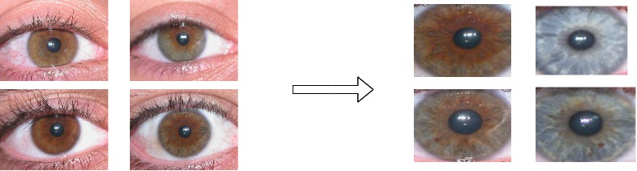
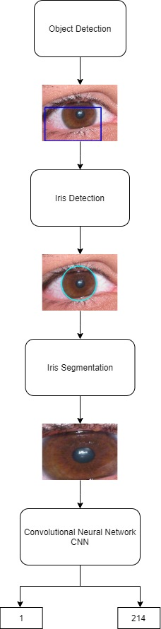

# Iris-Recognition-on-Ubiris-v2


## Definition

- This project represents a new iris recognition technique that detects and classify the iris images efficiently with high accuracy. The iris recognition model is beginning by eye detection process then the iris detection process takes place which detects the iris inside the eyes then iris segmentation process gets iris images that will be saved and used in the last process which is responsible for iris classification using convolutional neural network.<br/><br/>
- The dataset used in this project is Ubiris version 2 which contains 1214 images from different 214 classes(v2).<br/> <br/>
- The model uses a pre-trained convolutional neural network(CNN) model DenseNet-201 in the last process of iris classification.


## Description

- ##### eye_detection.py: this file represents the first process in this project where it's responsible for eye detection. This stage will ensure that the images contain eyes.

- ##### eyes_iris_detection.py: this file represents the second process where it's responsible for iris detection. The model takes the images detected in the last phase and it ensures that there is an iris inside the eyes the image will pass to the next step if it passed this step.

- ##### iris_segmentation.py: this file represents the third process where the iris features are extracted.

- ##### iris_extraction.py: this file combines all the above files in on file. it begins by eye detection then iris segmentation and saves the output that will be used in the iris classification process.

- ##### iris_classification. ipynb: this file represents the last process which is iris classification. this file uses pre-trained DenseNet-201 to classify between 214 different classes in ubiris.v2 dataset.

-  ##### image_aug.py: this file used for image augmentation but it's not necessary to use it as you can run the project without using this file.

##  How to run this project ?

### Dependencies

#### install this libraries:
- numpy
- keras
- sklearn
- opencv
- glob
- tensorflow

### To run this project you will need to:
1. Download the ubiris.v2 dataset from this link [Ubiris.v2](http://iris.di.ubi.pt/ubiris2.html)

2. Change your directory names that contain the dataset to the name in the python and notebook files in these  lines:<br/>
    - In iris_extreaction.py:
 
         ```html
        #here create directory name that contain the dataset "UBIRIS_200_150/Sessao_1/"
        
        for filepath in glob.iglob('UBIRIS_200_150/Sessao_1/*'):

        #here create directory name that contain the the extracted iris feautres "final_iris2/"
        cv2.imwrite('final_ iris2/'+str(L)+'.'+str(number)+".jpg",new_roi)

        ```
    - In iris_classification. ipynb:

         ```html
        # here directory name is "final_iris2" which contain extracted iris features
        
        for filefilepath in glob.iglob('final_iris2/*'):

        ```
3. Run iris_extraction.py.

4. Open iris_classification. Ipynb and run it's cells.


##### I wrote a research paper in this project found [here](https://www.isroset.org/pdf_paper_view.php?paper_id=1775&4-IJSRMS-03115.pdf)

